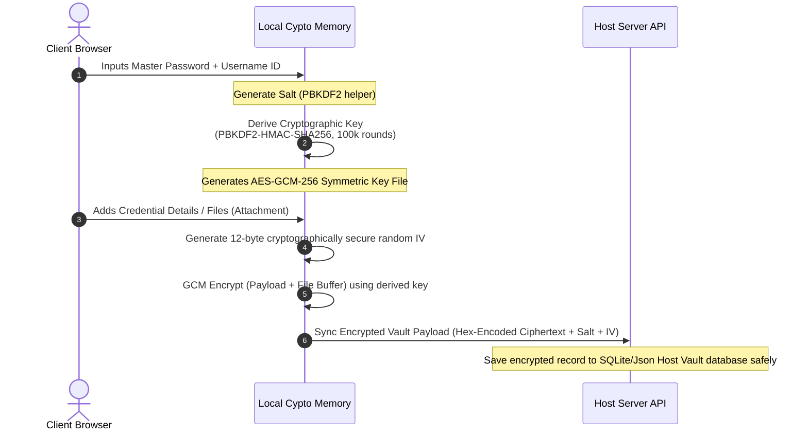

<p align="center">
  
</p>

<h1 align="center">SecureVault</h1>

<p align="center">
  <strong>Zero-Knowledge Cryptographic Vault & Self-Hosted Password Manager</strong><br />
  Secure, elegant, and completely client-encrypted storage system built with Web Crypto APIs.
</p>

<p align="center">
  
  
  
  
  
</p>

---

## 🎨 Aesthetic Theme Preview

> **Matte-Black & High-Contrast Calibrations**
>
> SecureVault features a dark slate visual appearance optimized for eyesafety and visual focus. Key borders are accented by neon teal highlights.
>
> 

---

## 🚀 Project Overview

SecureVault is an open-source, full-stack, offline-first personal credential and document database. Designed to replace central-hosted password managers, it guarantees complete cryptographic confidentiality: **your master password never leaves your browser in plaintext, and your data is fully encrypted before it is ever written to storage.**

### Core Pillars & System Capabilities

*   **🔑 Password Vault Workspace**: Custom categorized credential logs (Logins, Secure Notes, Credit Cards, Identities) designed for easy secure copy-on-verify procedures. Includes a built-in interactive entropy password generator.
*   **📝 Secure Notes & Document Vault**: A dedicated module allowing users to store private documents, critical text snippets, and physical file attachments (such as `.txt`, `.pdf`, and private keys under 4MB) with client-encrypted integrity.
*   **🛡️ Security Audit Center**: Real-time memory scanning of local credential health. It identifies weak password strings (length under 12 characters) and duplicate/reused keys instantly inside your sandbox without exposing decrypted values.
*   **💾 Local Snapshot & Backup Engine**: Trigger immediate full server snapshot writes on local volumes or download self-contained client-encrypted `.json` offline backup containers for independent self-recovery.

---

## ⚙️ System Architecture & Cryptographic Specs

### Zero-Knowledge Threat Model
SecureVault adheres to a strict zero-knowledge security blueprint:
1.  **Strict Client-Side Encryption**: Secrets are turned into cipher text *before* saving to disk or network synchronization.
2.  **No Server-Side Recovery Hooks**: Standard PBKDF2 parameters derive the AES decryption key block entirely based on user input. No backup keys are kept. Loss of the master password leads to absolute data loss.
3.  **Encrypted Attachments**: File buffers are converted to an ArrayBuffer, encrypted using custom randomly generated Initialization Vectors (IVs) per item, and transmitted in a secure hex GCM payload format.

### Key Derivation & Ingress Pipeline
This sequence diagram details how a master password is converted into an cryptographic key block inside your browser, establishing a secure envelope before transmission:



---

## 🛠️ Local Setup & Deployment Guide

### Prerequisites
To run the full-stack development environment sandbox, ensure you have the following installed:
*   [Node.js](https://nodejs.org/) (Version 18.x or above)
*   Npm package manager

### Installation Steps

1. **Clone the code repository and enter the directory**:
   ```bash
   git clone https://github.com/your-username/securevault.git
   cd securevault
   ```

2. **Install node dependencies**:
   ```bash
   npm install
   ```

3. **Establish Local Settings**:
   Create a `.env` file at the root of the project to declare necessary service identifiers:
   ```env
   # .env
   PORT=3000
   NODE_ENV=development
   ```

4. **Boot Development Environment Server**:
   ```bash
   npm run dev
   ```
   *The Express backend server will spin up the Vite middleware compiler and bind immediately to http://localhost:3000.*

---

## 🔒 Crucial Production Notes (SSL/HTTPS Mandates)

> [!IMPORTANT]
> SecureVault relies strictly on the browser's native window [Web Crypto API](https://developer.mozilla.org/en-US/docs/Web/API/Web_Crypto_API) framework (`window.crypto.subtle`) for PBKDF2 derivation and AES-GCM-256 wrapping operations.
>
> Browsers **only expose the Web Crypto API in secure contexts (HTTPS)**, or when pointing directly to `localhost`. If you deploy SecureVault to an external server or host environment, **you must configure valid SSL/TLS certificates (SSL / HTTPS)**. Failing to do so will result in the application failing lock validation and decryption operations on page load.
